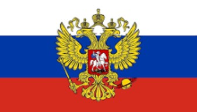
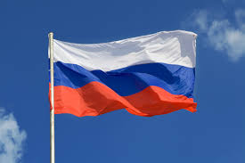
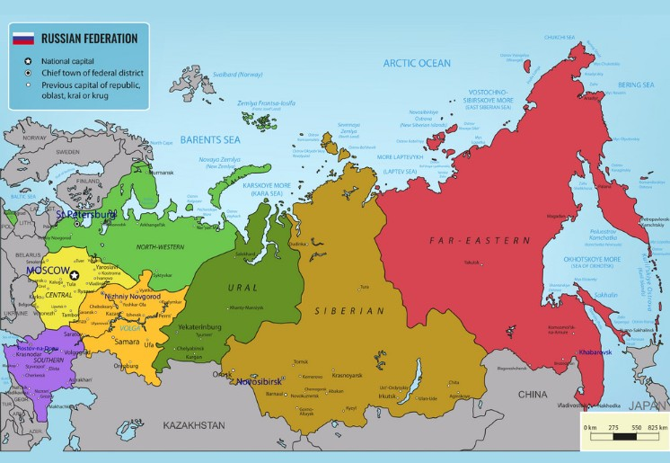

# Regional Diversity of Russia
This github.io website showcases the scenic beauty of russian culture in various regions of Russian Federation.  
For more info: https://www.russianlessons.net/russia  
  
**Russian Federation**
 
 
  
**Russia**
 
 
  
**Regional Map of Russia**
 
**Regions**:
1) **Central**  
2) **North-Western**  
3) **Volga**  
4) **Southern**  
5) **Urals**  
6) **Siberian**  
7) **Far-Eastern**  
